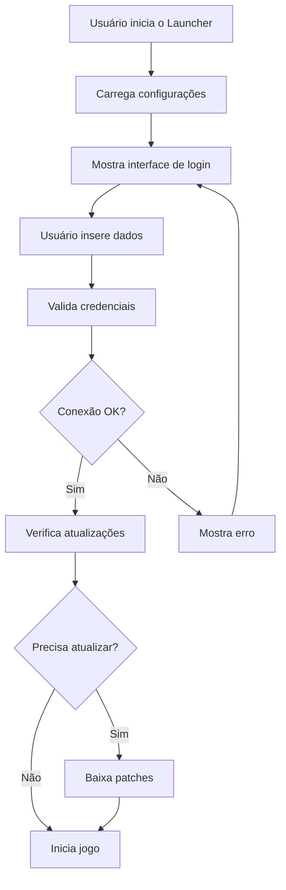

# 🎮 **MEGA CURSO: CRIANDO UM LAUNCHER DE JOGO DO ZERO**
## **MÓDULO 1: FUNDAMENTOS E PREPARAÇÃO**
### *"Entendendo o que vamos construir e preparando nosso ambiente"*

---

## 📖 **ÍNDICE DO MÓDULO**
- [O que é um Launcher?](#-o-que-é-um-launcher)
- [O que vamos construir?](#-o-que-vamos-construir-neste-curso)
- [Tecnologias que vamos usar](#-que-tecnologias-vamos-usar)
- [Arquitetura do Projeto](#-arquitetura-do-projeto)
- [Conceitos que você vai aprender](#-conceitos-que-você-vai-aprender)
- [Preparando o ambiente](#-preparando-seu-ambiente-de-desenvolvimento)
- [Mapa completo do curso](#-mapa-do-curso)
- [Resumo e próximos passos](#-resumo-do-módulo-1)

---

## 🤔 **O QUE É UM LAUNCHER?**

Imagine que você tem um jogo favorito no seu computador. Normalmente, para jogar, você precisa:

1. 📁 Encontrar o arquivo executável do jogo
2. ⚙️ Configurar algumas opções (como servidor, idioma, etc.)
3. 🔄 Verificar se há atualizações
4. 🔐 Fazer login com seu usuário e senha
5. 🎮 Finalmente iniciar o jogo

Um **launcher** é como um "garçom digital" que faz tudo isso pra você! É um programa pequenininho que:
- 🖥️ Te mostra uma interface bonita para fazer login
- 🌐 Conecta no servidor que você escolher
- 📦 Verifica se precisa baixar atualizações
- ⚙️ Configura tudo automaticamente
- 🚀 E finalmente inicia seu jogo

### 🎯 **EXEMPLOS DE LAUNCHERS FAMOSOS**
- **Steam** - Launcher para milhares de jogos
- **Battle.net** - Launcher da Blizzard (World of Warcraft, Diablo, etc.)
- **Epic Games Launcher** - Launcher da Epic Games
- **Origin** - Launcher da EA

---

## 🎯 **O QUE VAMOS CONSTRUIR NESTE CURSO?**

Vamos criar um launcher completo para o jogo **ArcheAge** que funciona com servidores privados baseados no **AAEmu** (que é como um "motor" que simula o servidor oficial do jogo).

### 🌟 **FUNCIONALIDADES DO NOSSO LAUNCHER**

#### ✅ **Interface Gráfica Profissional**
- Design bonito com imagens e botões customizados
- Animações e efeitos visuais
- Layout responsivo e intuitivo

#### ✅ **Sistema de Autenticação**
- Login com usuário e senha
- Criptografia de senhas (SHA256)
- Opção "Lembrar login"
- Diferentes tipos de autenticação (Trion, MailRu, etc.)

#### ✅ **Conectividade Avançada**
- Conexão com diferentes tipos de servidores
- Detecção automática de configurações
- Teste de conectividade
- Suporte a múltiplos protocolos

#### ✅ **Sistema Multi-idioma**
- Português, Inglês, Russo, Chinês, etc.
- Troca de idioma em tempo real
- Bandeiras dos países
- Localização completa da interface

#### ✅ **Sistema de Atualizações**
- Verificação automática de updates
- Download de patches
- Barra de progresso
- Sistema de validação de arquivos

#### ✅ **Configurações Avançadas**
- Múltiplos perfis de configuração
- Argumentos customizados de inicialização
- Configurações de HShield (anti-cheat)
- Localização automática do jogo

#### ✅ **Recursos Sociais**
- Feed de notícias do servidor
- Links para Discord
- Links para website do servidor
- Sistema de notificações

---

## 🛠 **QUE TECNOLOGIAS VAMOS USAR?**

### 🔷 **C# (C-Sharp)**
É nossa linguagem de programação principal. Pense nela como o "idioma" que usamos para conversar com o computador.

**Por que C#?**
- ✅ Fácil de aprender
- ✅ Muito poderosa
- ✅ Excelente para aplicações Windows
- ✅ Grande comunidade
- ✅ Documentação rica

### 🔷 **Windows Forms**
É a "caixa de ferramentas" para criar janelas, botões, caixas de texto, etc. É como um kit de LEGO para interfaces.

**Componentes que vamos usar:**
- `Form` - Janelas principais
- `Button` - Botões clicáveis
- `TextBox` - Campos de texto
- `Label` - Textos informativos
- `PictureBox` - Imagens
- `ProgressBar` - Barras de progresso
- `ComboBox` - Listas suspensas

### 🔷 **Visual Studio**
É nosso "ambiente de trabalho", como uma oficina super organizada onde criamos nossos programas.

**Recursos que vamos explorar:**
- Editor de código com destaque de sintaxe
- Designer visual para interfaces
- Debugger para encontrar erros
- Gerenciador de pacotes NuGet
- Sistema de controle de versão integrado

### 🔷 **.NET Framework 4.8**
É como a "fundação" onde nosso programa vai funcionar. Fornece todas as bibliotecas básicas.

### 🔷 **Bibliotecas Adicionais**
- **Newtonsoft.Json** - Para trabalhar com dados JSON
- **System.Security.Cryptography** - Para criptografia
- **System.Net** - Para conexões de rede

---

## 🏗 **ARQUITETURA DO PROJETO**

Nosso launcher será dividido em **4 partes principais**:

```
🗂️ SOLUÇÃO: AAEmu-Launcher
│
├── 📁 AAEmu.Launcher (PROJETO PRINCIPAL)
│   ├── 🎨 MainForm.cs - Interface principal do usuário
│   ├── 🔧 Helpers.cs - Funções auxiliares
│   ├── ⚙️ Program.cs - Ponto de entrada da aplicação
│   ├── 🖼️ Res/ - Pasta com recursos visuais
│   │   ├── 🖼️ Imagens (PNG)
│   │   ├── 🏳️ Bandeiras dos países
│   │   └── 🎨 Ícones e botões
│   ├── 🌐 lng/ - Arquivos de idiomas
│   └── 📄 Arquivos de configuração
│
├── 📁 AAEmu.Common.Launcher (BIBLIOTECA COMPARTILHADA)
│   ├── 🚀 BaseLauncher.cs - Classe base para todos os launchers
│   ├── 🎮 Trion12Launcher.cs - Launcher para servidores Trion 1.2
│   ├── 🎮 MailRu10Launcher.cs - Launcher para servidores MailRu
│   ├── 🔍 AAAutoDetectClient.cs - Detecção automática
│   └── 📊 SubStream.cs - Manipulação de streams
│
├── 📁 AAEmu.Patch (SISTEMA DE ATUALIZAÇÕES)
│   ├── 📦 Gerenciamento de patches
│   ├── 🔄 Sistema de download
│   └── ✅ Validação de arquivos
│
└── 📁 AAEmu.LauncherExample (EXEMPLO DE USO)
    └── 📖 Demonstrações de como usar a biblioteca
```

### 🔄 **FLUXO DE FUNCIONAMENTO**



---

## 🎯 **CONCEITOS QUE VOCÊ VAI APRENDER**

### 🔷 **1. Programação Orientada a Objetos (POO)**
Aprenda a criar "moldes" (classes) para organizar seu código de forma inteligente.

**Conceitos:**
- **Classes e Objetos** - Como criar "blueprints" para seus dados
- **Herança** - Como reutilizar código de forma elegante
- **Encapsulamento** - Como proteger dados sensíveis
- **Polimorfismo** - Como fazer o mesmo código funcionar de formas diferentes

### 🔷 **2. Interfaces Gráficas (GUI)**
Aprenda a criar janelas bonitas que o usuário pode interagir.

**Conceitos:**
- **Event-Driven Programming** - Como responder a cliques e ações do usuário
- **Layout Management** - Como organizar elementos na tela
- **Custom Drawing** - Como desenhar elementos personalizados
- **Resource Management** - Como gerenciar imagens e recursos

### 🔷 **3. Conexões de Rede**
Aprenda como seu programa conversa com servidores na internet.

**Conceitos:**
- **TCP/IP** - Protocolo básico de comunicação
- **HTTP Requests** - Como buscar dados de websites
- **Timeouts** - Como lidar com conexões lentas
- **Error Handling** - Como tratar problemas de rede

### 🔷 **4. Manipulação de Arquivos**
Aprenda como ler e escrever configurações no computador.

**Conceitos:**
- **File I/O** - Leitura e escrita de arquivos
- **JSON** - Formato moderno para dados estruturados
- **Configuration Files** - Como salvar preferências do usuário
- **Path Management** - Como trabalhar com caminhos de arquivos

### 🔷 **5. Criptografia Básica**
Aprenda como proteger senhas e dados sensíveis.

**Conceitos:**
- **Hashing** - Como transformar senhas em códigos seguros
- **SHA256** - Algoritmo moderno de hash
- **Salt** - Como adicionar segurança extra
- **Validation** - Como verificar integridade de dados

### 🔷 **6. Programação Multi-threaded**
Aprenda como fazer múltiplas coisas ao mesmo tempo.

**Conceitos:**
- **Threads** - Como criar processos paralelos
- **Async/Await** - Programação assíncrona moderna
- **Thread Safety** - Como evitar conflitos entre threads
- **UI Threading** - Como atualizar interface sem travar

### 🔷 **7. Gestão de Configurações**
Aprenda como criar sistemas flexíveis de configuração.

**Conceitos:**
- **Settings Management** - Como organizar configurações
- **Profile System** - Como suportar múltiplos usuários
- **Migration** - Como atualizar configurações antigas
- **Validation** - Como garantir dados válidos

---

## 📋 **PREPARANDO SEU AMBIENTE DE DESENVOLVIMENTO**

### 🔷 **1. Visual Studio Community (OBRIGATÓRIO)**

**Download:** https://visualstudio.microsoft.com/vs/community/

**Configuração necessária:**
- ✅ Workload: ".NET desktop development"
- ✅ .NET Framework 4.8
- ✅ Windows Forms support
- ✅ NuGet package manager

**Componentes individuais importantes:**
- ✅ .NET Framework 4.8 targeting pack
- ✅ Windows 10 SDK
- ✅ Git for Windows

### 🔷 **2. Git para Controle de Versão (RECOMENDADO)**

**Download:** https://git-scm.com/download/win

**Para que serve:**
- 📝 Acompanhar mudanças no código
- 🔄 Voltar para versões anteriores se algo der errado
- 🤝 Compartilhar código com outros
- 📊 Ver histórico de desenvolvimento

### 🔷 **3. Navegador Web Moderno**
- Chrome, Firefox, ou Edge atualizado
- Para testar links e buscar documentação

### 🔷 **4. Editor de Texto Alternativo (OPCIONAL)**
- **Notepad++** ou **VS Code** para editar arquivos de configuração

### 🔷 **5. Ferramentas de Imagem (OPCIONAL)**
- **GIMP** (gratuito) ou **Photoshop** para editar recursos visuais
- **Paint.NET** como alternativa simples

---

## 🗺 **MAPA DO CURSO**

### 📚 **PARTE I: FUNDAMENTOS**
- **MÓDULO 1** ✅ **Fundamentos e Preparação** *(você está aqui!)*
- **MÓDULO 2** → **Criando a Estrutura Base do Projeto**
- **MÓDULO 3** → **Desenvolvendo a Interface Gráfica Básica**

### 🏗 **PARTE II: DESENVOLVIMENTO CORE**
- **MÓDULO 4** → **Sistema de Configurações e JSON**
- **MÓDULO 5** → **Sistema de Login e Criptografia**
- **MÓDULO 6** → **Conexão com Servidores**
- **MÓDULO 7** → **Sistema de Launchers Múltiplos**

### 🚀 **PARTE III: FUNCIONALIDADES AVANÇADAS**
- **MÓDULO 8** → **Sistema de Atualizações e Patches**
- **MÓDULO 9** → **Recursos Visuais e Sistema de Idiomas**
- **MÓDULO 10** → **Funcionalidades Avançadas e Otimização**

### 📦 **PARTE IV: FINALIZAÇÃO**
- **MÓDULO 11** → **Compilação, Testes e Distribuição**
- **MÓDULO 12** → **Personalização Avançada e Extensões**

### 🎯 **CARGA HORÁRIA ESTIMADA**
- **Total:** ~40-50 horas
- **Por módulo:** 3-5 horas
- **Ritmo recomendado:** 1 módulo por semana

---

## 🎯 **RESUMO DO MÓDULO 1**

### ✅ **O QUE VOCÊ APRENDEU HOJE:**

1. **Conceito de Launcher**
   - O que é e para que serve
   - Exemplos práticos de launchers famosos
   - Importância na experiência do usuário

2. **Visão Geral do Projeto**
   - Funcionalidades que vamos implementar
   - Tecnologias que vamos usar
   - Arquitetura do sistema

3. **Conceitos Técnicos**
   - Programação Orientada a Objetos
   - Interfaces gráficas
   - Conexões de rede
   - Manipulação de arquivos
   - Criptografia básica
   - Multi-threading

4. **Preparação do Ambiente**
   - Ferramentas necessárias
   - Configuração do Visual Studio
   - Recursos adicionais úteis

### 🎯 **METAS PARA O PRÓXIMO MÓDULO:**

No **MÓDULO 2**, você vai:
- ✅ Criar seu primeiro projeto Windows Forms
- ✅ Configurar a estrutura de pastas
- ✅ Adicionar dependências necessárias
- ✅ Fazer sua primeira janela aparecer
- ✅ Entender a estrutura de arquivos do Visual Studio
- ✅ Criar a base para todos os outros módulos

---

## 🚀 **PREPARADO PARA O PRÓXIMO MÓDULO?**

### 📋 **CHECKLIST ANTES DE CONTINUAR:**

- [ ] Visual Studio Community instalado e funcionando
- [ ] .NET Framework 4.8 disponível
- [ ] Git instalado (opcional mas recomendado)
- [ ] Entendimento básico dos conceitos apresentados
- [ ] Ambiente organizado para desenvolvimento

### 🎮 **MOTIVAÇÃO:**
Lembre-se: você está começando uma jornada incrível! Ao final deste curso, você terá não apenas um launcher funcionando, mas também conhecimento sólido em programação C#, interfaces gráficas, e desenvolvimento de software profissional.

### 🔥 **PRÓXIMO PASSO:**
Quando estiver pronto para começar a programar de verdade, abra o **MÓDULO 2: CRIANDO A ESTRUTURA BASE DO PROJETO**.

Lá vamos finalmente botar a mão na massa e ver nosso primeiro código funcionando!

---

### 📞 **SUPORTE E COMUNIDADE**

Se tiver dúvidas durante o curso:
1. Releia a seção relevante do módulo
2. Consulte a documentação oficial do C#
3. Procure por soluções em fóruns como Stack Overflow
4. Pratique com pequenos exemplos antes de aplicar no projeto principal

**Lembre-se:** Todo programador profissional começou exatamente onde você está agora! 🌟

---

**© 2024 Mega Curso Launcher ArcheAge - Todos os direitos reservados**
*Curso elaborado com ❤️ para a comunidade brasileira de desenvolvedores*