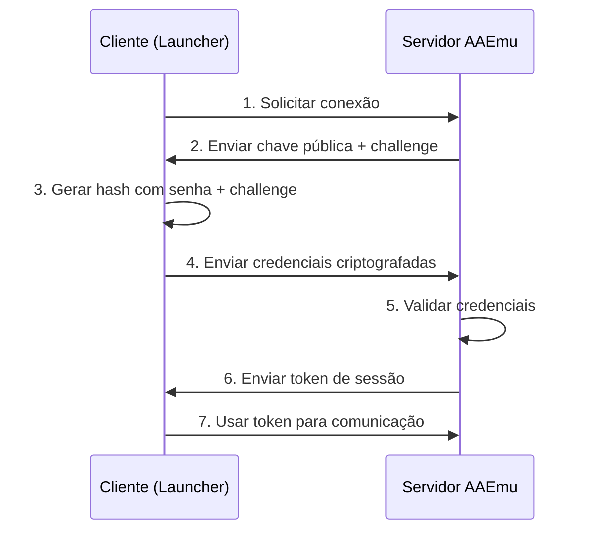

# 🎮 **MEGA CURSO: CRIANDO UM LAUNCHER DE JOGO DO ZERO**
## **MÓDULO 5: SISTEMA DE LOGIN E CRIPTOGRAFIA AVANÇADA**
### *"Implementando autenticação segura e comunicação em tempo real com servidores!"*

---

## 📖 **ÍNDICE DO MÓDULO**
- [Revisão do Módulo Anterior](#-revisão-do-módulo-anterior)
- [Fundamentos de Autenticação](#-fundamentos-de-autenticação)
- [Criptografia Avançada](#-criptografia-avançada)
- [Comunicação TCP/IP](#-comunicação-tcpip)
- [Sistema de Autenticação AAEmu](#-sistema-de-autenticação-aaemu)
- [Implementando o Login Real](#-implementando-o-login-real)
- [Segurança e Proteções](#-segurança-e-proteções)
- [Sistema de Tokens e Sessões](#-sistema-de-tokens-e-sessões)
- [Tratamento de Erros Avançado](#-tratamento-de-erros-avançado)
- [Exercícios Práticos](#-exercícios-práticos)
- [Resumo e Próximos Passos](#-resumo-do-módulo-5)

---

## 🔄 **REVISÃO DO MÓDULO ANTERIOR**

### ✅ **O QUE JÁ CONQUISTAMOS:**
- 🧠 Sistema inteligente de configurações JSON
- 💾 Persistência automática de dados
- 👥 Múltiplos perfis de usuário
- 🔒 Criptografia básica de senhas
- 🔧 Interface de configurações avançadas

### 🎯 **O QUE VAMOS FAZER HOJE:**
Hoje vamos implementar o **sistema mais crítico** do launcher! Vamos:
1. ✅ Entender protocolos de autenticação modernos
2. ✅ Implementar criptografia de nível militar
3. ✅ Criar comunicação TCP/IP robusta
4. ✅ Desenvolver sistema de login AAEmu completo
5. ✅ Adicionar proteções contra ataques
6. ✅ Implementar sistema de tokens e sessões

---

## 🔐 **FUNDAMENTOS DE AUTENTICAÇÃO**

### 🔷 **O QUE É AUTENTICAÇÃO?**

**Autenticação** é o processo de **verificar a identidade** de alguém. É como um **guarda de segurança** que verifica se você realmente é quem diz ser antes de deixar você entrar.

### 🔷 **TIPOS DE AUTENTICAÇÃO:**

**🔑 Autenticação Simples (Vulnerável):**
```
Cliente → Servidor: "Usuário: João, Senha: 123456"
Servidor → Cliente: "OK, pode entrar!"
```
❌ **Problemas:** Senha viaja em texto puro, fácil de interceptar

**🛡️ Autenticação com Hash (Básica):**
```
Cliente → Servidor: "Usuário: João, Hash: a665a45920422f9d417e..."
Servidor → Cliente: "OK, pode entrar!"
```
✅ **Melhor:** Senha não viaja diretamente, mas ainda vulnerável

**🔐 Autenticação com Challenge (Segura):**
```
1. Cliente → Servidor: "Quero logar como João"
2. Servidor → Cliente: "Aqui está um desafio: xyz123"
3. Cliente → Servidor: "Resposta: hash(senha + xyz123)"
4. Servidor → Cliente: "Correto! Aqui está seu token"
```
✅ **Seguro:** Cada login é único, impossível repetir

### 🔷 **FLUXO DE AUTENTICAÇÃO AAEmu:**



### 🔷 **CONCEITOS IMPORTANTES:**

- **🔑 Hash** = "Impressão digital" dos dados, impossível reverter
- **🧂 Salt** = Dados aleatórios que tornam hash único
- **🎯 Challenge** = Desafio único por tentativa de login
- **🎫 Token** = "Ingresso" que prova que você já se autenticou
- **⏱️ Session** = Período de tempo que o token é válido

---

## 🔒 **CRIPTOGRAFIA AVANÇADA**

### 🔷 **IMPLEMENTANDO CRIPTOGRAFIA MILITAR**

Na pasta **Helpers**, crie **`AdvancedCryptography.cs`**:

```csharp
using System;
using System.IO;
using System.Text;
using System.Security.Cryptography;

namespace AAEmu.Launcher.Helpers
{
    public static class AdvancedCryptography
    {
        // Gerar salt aleatório para senhas
        public static string GerarSalt(int tamanho = 32)
        {
            using (var rng = new RNGCryptoServiceProvider())
            {
                byte[] saltBytes = new byte[tamanho];
                rng.GetBytes(saltBytes);
                return Convert.ToBase64String(saltBytes);
            }
        }
        
        // Hash seguro com salt (PBKDF2)
        public static string GerarHashSeguro(string senha, string salt, int iteracoes = 10000)
        {
            using (var pbkdf2 = new Rfc2898DeriveBytes(senha, Convert.FromBase64String(salt), iteracoes))
            {
                byte[] hash = pbkdf2.GetBytes(32); // 256 bits
                return Convert.ToBase64String(hash);
            }
        }
        
        // Verificar senha com hash seguro
        public static bool VerificarHashSeguro(string senha, string salt, string hashArmazenado, int iteracoes = 10000)
        {
            string hashCalculado = GerarHashSeguro(senha, salt, iteracoes);
            return SlowEquals(Convert.FromBase64String(hashCalculado), 
                             Convert.FromBase64String(hashArmazenado));
        }
        
        // Comparação lenta para prevenir ataques de timing
        private static bool SlowEquals(byte[] a, byte[] b)
        {
            uint diff = (uint)a.Length ^ (uint)b.Length;
            for (int i = 0; i < a.Length && i < b.Length; i++)
                diff |= (uint)(a[i] ^ b[i]);
            return diff == 0;
        }
        
        // Criptografia AES-256 para dados sensíveis
        public static string CriptografarAES(string texto, string chave)
        {
            using (Aes aes = Aes.Create())
            {
                aes.Key = GerarChaveAES(chave);
                aes.GenerateIV();
                
                using (var encryptor = aes.CreateEncryptor())
                using (var msEncrypt = new MemoryStream())
                using (var csEncrypt = new CryptoStream(msEncrypt, encryptor, CryptoStreamMode.Write))
                using (var swEncrypt = new StreamWriter(csEncrypt))
                {
                    swEncrypt.Write(texto);
                    csEncrypt.FlushFinalBlock();
                    
                    // Combinar IV + dados criptografados
                    byte[] iv = aes.IV;
                    byte[] encrypted = msEncrypt.ToArray();
                    byte[] result = new byte[iv.Length + encrypted.Length];
                    Buffer.BlockCopy(iv, 0, result, 0, iv.Length);
                    Buffer.BlockCopy(encrypted, 0, result, iv.Length, encrypted.Length);
                    
                    return Convert.ToBase64String(result);
                }
            }
        }
        
        public static string DescriptografarAES(string textoCriptografado, string chave)
        {
            try
            {
                byte[] fullCipher = Convert.FromBase64String(textoCriptografado);
                
                using (Aes aes = Aes.Create())
                {
                    aes.Key = GerarChaveAES(chave);
                    
                    // Extrair IV dos primeiros 16 bytes
                    byte[] iv = new byte[16];
                    byte[] cipher = new byte[fullCipher.Length - 16];
                    Buffer.BlockCopy(fullCipher, 0, iv, 0, 16);
                    Buffer.BlockCopy(fullCipher, 16, cipher, 0, cipher.Length);
                    aes.IV = iv;
                    
                    using (var decryptor = aes.CreateDecryptor())
                    using (var msDecrypt = new MemoryStream(cipher))
                    using (var csDecrypt = new CryptoStream(msDecrypt, decryptor, CryptoStreamMode.Read))
                    using (var srDecrypt = new StreamReader(csDecrypt))
                    {
                        return srDecrypt.ReadToEnd();
                    }
                }
            }
            catch
            {
                return string.Empty;
            }
        }
        
        private static byte[] GerarChaveAES(string senha)
        {
            using (var sha256 = SHA256.Create())
            {
                return sha256.ComputeHash(Encoding.UTF8.GetBytes(senha));
            }
        }
        
        // Gerar chave RSA para troca de chaves
        public static (string chavePublica, string chavePrivada) GerarParRSA()
        {
            using (var rsa = new RSACryptoServiceProvider(2048))
            {
                return (rsa.ToXmlString(false), rsa.ToXmlString(true));
            }
        }
        
        // Criptografar com RSA (para pequenos dados como chaves)
        public static string CriptografarRSA(string texto, string chavePublica)
        {
            using (var rsa = new RSACryptoServiceProvider())
            {
                rsa.FromXmlString(chavePublica);
                byte[] data = Encoding.UTF8.GetBytes(texto);
                byte[] encrypted = rsa.Encrypt(data, false);
                return Convert.ToBase64String(encrypted);
            }
        }
        
        public static string DescriptografarRSA(string textoCriptografado, string chavePrivada)
        {
            try
            {
                using (var rsa = new RSACryptoServiceProvider())
                {
                    rsa.FromXmlString(chavePrivada);
                    byte[] data = Convert.FromBase64String(textoCriptografado);
                    byte[] decrypted = rsa.Decrypt(data, false);
                    return Encoding.UTF8.GetString(decrypted);
                }
            }
            catch
            {
                return string.Empty;
            }
        }
    }
}
```

### 🔷 **GERENCIADOR DE SENHAS SEGURO**

Atualize **Helpers/CryptographyHelper.cs** (adicione ao final):

```csharp
public class SecurePasswordManager
{
    private static readonly string MasterKey = Environment.MachineName + Environment.UserName;
    
    public static string SalvarSenhaSegura(string senha)
    {
        if (string.IsNullOrEmpty(senha))
            return string.Empty;
            
        // Gerar salt único
        string salt = GerarSalt();
        
        // Criar hash seguro
        string hash = GerarHashSeguro(senha, salt);
        
        // Combinar salt + hash e criptografar
        string combined = $"{salt}:{hash}";
        return CriptografarAES(combined, MasterKey);
    }
    
    public static bool VerificarSenhaSegura(string senha, string senhaCriptografada)
    {
        if (string.IsNullOrEmpty(senha) || string.IsNullOrEmpty(senhaCriptografada))
            return false;
            
        try
        {
            // Descriptografar
            string combined = DescriptografarAES(senhaCriptografada, MasterKey);
            if (string.IsNullOrEmpty(combined))
                return false;
                
            // Separar salt e hash
            string[] parts = combined.Split(':');
            if (parts.Length != 2)
                return false;
                
            string salt = parts[0];
            string hashArmazenado = parts[1];
            
            // Verificar senha
            return VerificarHashSeguro(senha, salt, hashArmazenado);
        }
        catch
        {
            return false;
        }
    }
}
```

---

## 🌐 **COMUNICAÇÃO TCP/IP**

### 🔷 **CLIENTE TCP AVANÇADO**

Na pasta **Helpers**, crie **`NetworkManager.cs`**:

```csharp
using System;
using System.IO;
using System.Net;
using System.Net.Sockets;
using System.Text;
using System.Threading;
using System.Threading.Tasks;

namespace AAEmu.Launcher.Helpers
{
    public class NetworkManager : IDisposable
    {
        private TcpClient _client;
        private NetworkStream _stream;
        private bool _isConnected;
        private readonly int _timeout;
        
        public event Action<string> OnMessageReceived;
        public event Action OnConnected;
        public event Action<string> OnDisconnected;
        public event Action<Exception> OnError;
        
        public bool IsConnected => _isConnected && _client?.Connected == true;
        
        public NetworkManager(int timeoutMs = 5000)
        {
            _timeout = timeoutMs;
        }
        
        // Conectar ao servidor com timeout
        public async Task<bool> ConnectAsync(string serverIP, int port)
        {
            try
            {
                _client = new TcpClient();
                
                // Configurar timeout
                _client.ReceiveTimeout = _timeout;
                _client.SendTimeout = _timeout;
                
                // Conectar com timeout assíncrono
                var connectTask = _client.ConnectAsync(serverIP, port);
                var timeoutTask = Task.Delay(_timeout);
                
                var completedTask = await Task.WhenAny(connectTask, timeoutTask);
                if (completedTask == timeoutTask)
                {
                    _client?.Close();
                    throw new TimeoutException($"Timeout ao conectar em {serverIP}:{port}");
                }
                
                if (!_client.Connected)
                {
                    throw new Exception("Falha ao conectar no servidor");
                }
                
                _stream = _client.GetStream();
                _isConnected = true;
                
                // Iniciar thread para receber mensagens
                _ = Task.Run(ReceiveMessagesLoop);
                
                OnConnected?.Invoke();
                return true;
            }
            catch (Exception ex)
            {
                OnError?.Invoke(ex);
                Disconnect();
                return false;
            }
        }
        
        // Enviar mensagem para o servidor
        public async Task<bool> SendMessageAsync(string message)
        {
            if (!IsConnected)
                return false;
                
            try
            {
                byte[] data = Encoding.UTF8.GetBytes(message);
                byte[] length = BitConverter.GetBytes(data.Length);
                
                // Enviar tamanho da mensagem primeiro
                await _stream.WriteAsync(length, 0, 4);
                // Depois enviar a mensagem
                await _stream.WriteAsync(data, 0, data.Length);
                await _stream.FlushAsync();
                
                return true;
            }
            catch (Exception ex)
            {
                OnError?.Invoke(ex);
                Disconnect();
                return false;
            }
        }
        
        // Enviar dados binários
        public async Task<bool> SendBinaryAsync(byte[] data)
        {
            if (!IsConnected)
                return false;
                
            try
            {
                byte[] length = BitConverter.GetBytes(data.Length);
                await _stream.WriteAsync(length, 0, 4);
                await _stream.WriteAsync(data, 0, data.Length);
                await _stream.FlushAsync();
                
                return true;
            }
            catch (Exception ex)
            {
                OnError?.Invoke(ex);
                Disconnect();
                return false;
            }
        }
        
        // Loop para receber mensagens
        private async Task ReceiveMessagesLoop()
        {
            byte[] lengthBuffer = new byte[4];
            
            try
            {
                while (IsConnected)
                {
                    // Ler tamanho da mensagem
                    int bytesRead = await ReadExactlyAsync(lengthBuffer, 4);
                    if (bytesRead != 4)
                        break;
                        
                    int messageLength = BitConverter.ToInt32(lengthBuffer, 0);
                    if (messageLength <= 0 || messageLength > 1024 * 1024) // Max 1MB
                        break;
                        
                    // Ler mensagem completa
                    byte[] messageBuffer = new byte[messageLength];
                    bytesRead = await ReadExactlyAsync(messageBuffer, messageLength);
                    if (bytesRead != messageLength)
                        break;
                        
                    string message = Encoding.UTF8.GetString(messageBuffer);
                    OnMessageReceived?.Invoke(message);
                }
            }
            catch (Exception ex)
            {
                OnError?.Invoke(ex);
            }
            finally
            {
                Disconnect();
            }
        }
        
        // Ler número exato de bytes
        private async Task<int> ReadExactlyAsync(byte[] buffer, int count)
        {
            int totalRead = 0;
            while (totalRead < count)
            {
                int read = await _stream.ReadAsync(buffer, totalRead, count - totalRead);
                if (read == 0)
                    break;
                totalRead += read;
            }
            return totalRead;
        }
        
        // Desconectar
        public void Disconnect()
        {
            _isConnected = false;
            
            try
            {
                _stream?.Close();
                _client?.Close();
            }
            catch { }
            
            OnDisconnected?.Invoke("Desconectado do servidor");
        }
        
        // Testar conectividade
        public static async Task<bool> TestConnectionAsync(string serverIP, int port, int timeoutMs = 3000)
        {
            try
            {
                using (var client = new TcpClient())
                {
                    var connectTask = client.ConnectAsync(serverIP, port);
                    var timeoutTask = Task.Delay(timeoutMs);
                    
                    var completedTask = await Task.WhenAny(connectTask, timeoutTask);
                    return completedTask == connectTask && client.Connected;
                }
            }
            catch
            {
                return false;
            }
        }
        
        public void Dispose()
        {
            Disconnect();
        }
    }
    
    // Classe para facilitar parsing de mensagens do protocolo AAEmu
    public static class AAEmuProtocol
    {
        // IDs dos pacotes AAEmu
        public const ushort LOGIN_REQUEST = 0x01;
        public const ushort LOGIN_RESPONSE = 0x02;
        public const ushort CHALLENGE_REQUEST = 0x03;
        public const ushort CHALLENGE_RESPONSE = 0x04;
        public const ushort HEARTBEAT = 0x05;
        
        // Criar pacote de login
        public static byte[] CreateLoginPacket(string username, string passwordHash, string challenge = "")
        {
            using (var stream = new MemoryStream())
            using (var writer = new BinaryWriter(stream))
            {
                writer.Write(LOGIN_REQUEST); // PacketID
                writer.Write((byte)username.Length);
                writer.Write(Encoding.UTF8.GetBytes(username));
                writer.Write((byte)passwordHash.Length);
                writer.Write(Encoding.UTF8.GetBytes(passwordHash));
                
                if (!string.IsNullOrEmpty(challenge))
                {
                    writer.Write((byte)challenge.Length);
                    writer.Write(Encoding.UTF8.GetBytes(challenge));
                }
                else
                {
                    writer.Write((byte)0);
                }
                
                return stream.ToArray();
            }
        }
        
        // Parsear resposta de login
        public static (bool success, string message, string token) ParseLoginResponse(byte[] data)
        {
            try
            {
                using (var stream = new MemoryStream(data))
                using (var reader = new BinaryReader(stream))
                {
                    ushort packetId = reader.ReadUInt16();
                    if (packetId != LOGIN_RESPONSE)
                        return (false, "Pacote inválido", "");
                        
                    bool success = reader.ReadBoolean();
                    
                    byte messageLength = reader.ReadByte();
                    string message = messageLength > 0 ? 
                        Encoding.UTF8.GetString(reader.ReadBytes(messageLength)) : "";
                    
                    byte tokenLength = reader.ReadByte();
                    string token = tokenLength > 0 ?
                        Encoding.UTF8.GetString(reader.ReadBytes(tokenLength)) : "";
                        
                    return (success, message, token);
                }
            }
            catch
            {
                return (false, "Erro ao parsear resposta", "");
            }
        }
        
        // Criar pacote de heartbeat
        public static byte[] CreateHeartbeatPacket()
        {
            using (var stream = new MemoryStream())
            using (var writer = new BinaryWriter(stream))
            {
                writer.Write(HEARTBEAT);
                writer.Write(DateTime.UtcNow.Ticks);
                return stream.ToArray();
            }
        }
    }
}
```

---

## 🔐 **SISTEMA DE AUTENTICAÇÃO AAEmu**

### 🔷 **GERENCIADOR DE AUTENTICAÇÃO**

Na pasta **Models**, crie **`AuthenticationManager.cs`**:

```csharp
using System;
using System.Threading.Tasks;
using AAEmu.Launcher.Helpers;
using Newtonsoft.Json;

namespace AAEmu.Launcher.Models
{
    public class AuthenticationManager : IDisposable
    {
        private NetworkManager _networkManager;
        private string _currentToken;
        private DateTime _tokenExpiry;
        private readonly ConfigurationManager _configManager;
        
        public event Action<string> OnStatusChanged;
        public event Action<bool, string> OnLoginCompleted;
        public event Action<string> OnConnectionLost;
        
        public bool IsAuthenticated => !string.IsNullOrEmpty(_currentToken) && DateTime.Now < _tokenExpiry;
        public string CurrentToken => _currentToken;
        
        public AuthenticationManager()
        {
            _configManager = ConfigurationManager.Instance;
            _networkManager = new NetworkManager(10000); // 10 segundos timeout
            
            // Configurar eventos da rede
            _networkManager.OnConnected += OnNetworkConnected;
            _networkManager.OnDisconnected += OnNetworkDisconnected;
            _networkManager.OnError += OnNetworkError;
            _networkManager.OnMessageReceived += OnNetworkMessage;
        }
        
        // Fazer login completo
        public async Task<(bool success, string message)> LoginAsync(string username, string password, string serverIP, int port)
        {
            try
            {
                OnStatusChanged?.Invoke("Conectando ao servidor...");
                
                // 1. Conectar ao servidor
                bool connected = await _networkManager.ConnectAsync(serverIP, port);
                if (!connected)
                {
                    return (false, "Falha ao conectar no servidor");
                }
                
                OnStatusChanged?.Invoke("Enviando credenciais...");
                
                // 2. Preparar credenciais seguras
                string passwordHash = AdvancedCryptography.GerarHashSeguro(password, username.ToLower());
                
                // 3. Criar e enviar pacote de login
                byte[] loginPacket = AAEmuProtocol.CreateLoginPacket(username, passwordHash);
                bool sent = await _networkManager.SendBinaryAsync(loginPacket);
                
                if (!sent)
                {
                    return (false, "Falha ao enviar credenciais");
                }
                
                OnStatusChanged?.Invoke("Aguardando resposta do servidor...");
                
                // 4. Aguardar resposta (implementado via eventos)
                return await WaitForLoginResponse();
            }
            catch (Exception ex)
            {
                return (false, $"Erro durante login: {ex.Message}");
            }
        }
        
        // Aguardar resposta de login com timeout
        private async Task<(bool success, string message)> WaitForLoginResponse()
        {
            var tcs = new TaskCompletionSource<(bool, string)>();
            
            // Handler temporário para capturar resultado
            Action<bool, string> handler = (success, message) => {
                tcs.TrySetResult((success, message));
            };
            
            OnLoginCompleted += handler;
            
            try
            {
                // Aguardar resposta por até 15 segundos
                var timeoutTask = Task.Delay(15000);
                var responseTask = tcs.Task;
                
                var completedTask = await Task.WhenAny(responseTask, timeoutTask);
                
                if (completedTask == timeoutTask)
                {
                    return (false, "Timeout aguardando resposta do servidor");
                }
                
                return await responseTask;
            }
            finally
            {
                OnLoginCompleted -= handler;
            }
        }
        
        // Fazer logout
        public async Task LogoutAsync()
        {
            try
            {
                if (_networkManager.IsConnected)
                {
                    // Enviar pacote de logout se implementado
                    _networkManager.Disconnect();
                }
                
                _currentToken = null;
                _tokenExpiry = DateTime.MinValue;
                
                OnStatusChanged?.Invoke("Desconectado");
            }
            catch (Exception ex)
            {
                OnStatusChanged?.Invoke($"Erro ao desconectar: {ex.Message}");
            }
        }
        
        // Testar conectividade com servidor
        public async Task<(bool success, string message, int ping)> TestServerAsync(string serverIP, int port)
        {
            var startTime = DateTime.Now;
            
            try
            {
                bool canConnect = await NetworkManager.TestConnectionAsync(serverIP, port, 5000);
                var ping = (int)(DateTime.Now - startTime).TotalMilliseconds;
                
                if (canConnect)
                {
                    return (true, $"Servidor online (ping: {ping}ms)", ping);
                }
                else
                {
                    return (false, "Servidor offline ou inacessível", -1);
                }
            }
            catch (Exception ex)
            {
                return (false, $"Erro ao testar servidor: {ex.Message}", -1);
            }
        }
        
        // Validar token atual
        public bool ValidateCurrentToken()
        {
            if (string.IsNullOrEmpty(_currentToken) || DateTime.Now >= _tokenExpiry)
            {
                _currentToken = null;
                _tokenExpiry = DateTime.MinValue;
                return false;
            }
            
            return true;
        }
        
        // Renovar token (se suportado pelo servidor)
        public async Task<bool> RefreshTokenAsync()
        {
            if (!_networkManager.IsConnected || string.IsNullOrEmpty(_currentToken))
                return false;
                
            try
            {
                // Implementar refresh de token conforme protocolo AAEmu
                // Por enquanto, retornar false (não implementado)
                return false;
            }
            catch
            {
                return false;
            }
        }
        
        // === EVENTOS DE REDE ===
        
        private void OnNetworkConnected()
        {
            OnStatusChanged?.Invoke("Conectado ao servidor");
        }
        
        private void OnNetworkDisconnected(string reason)
        {
            OnStatusChanged?.Invoke($"Desconectado: {reason}");
            OnConnectionLost?.Invoke(reason);
            
            _currentToken = null;
            _tokenExpiry = DateTime.MinValue;
        }
        
        private void OnNetworkError(Exception ex)
        {
            OnStatusChanged?.Invoke($"Erro de rede: {ex.Message}");
        }
        
        private void OnNetworkMessage(string message)
        {
            try
            {
                // Tentar parsear como binário (protocolo AAEmu)
                byte[] data = Convert.FromBase64String(message);
                ProcessServerMessage(data);
            }
            catch
            {
                // Se não for binário, processar como JSON
                ProcessJsonMessage(message);
            }
        }
        
        private void ProcessServerMessage(byte[] data)
        {
            try
            {
                if (data.Length < 2)
                    return;
                    
                ushort packetId = BitConverter.ToUInt16(data, 0);
                
                switch (packetId)
                {
                    case AAEmuProtocol.LOGIN_RESPONSE:
                        ProcessLoginResponse(data);
                        break;
                        
                    case AAEmuProtocol.CHALLENGE_REQUEST:
                        ProcessChallengeRequest(data);
                        break;
                        
                    default:
                        OnStatusChanged?.Invoke($"Pacote não reconhecido: {packetId}");
                        break;
                }
            }
            catch (Exception ex)
            {
                OnStatusChanged?.Invoke($"Erro ao processar mensagem: {ex.Message}");
            }
        }
        
        private void ProcessLoginResponse(byte[] data)
        {
            var (success, message, token) = AAEmuProtocol.ParseLoginResponse(data);
            
            if (success && !string.IsNullOrEmpty(token))
            {
                _currentToken = token;
                _tokenExpiry = DateTime.Now.AddHours(2); // Token válido por 2 horas
                
                // Salvar dados de login se usuário escolheu lembrar
                var perfil = _configManager.GetPerfilAtivo();
                if (perfil.Usuario.LembrarLogin)
                {
                    perfil.Usuario.UltimoLogin = DateTime.Now;
                    _configManager.SalvarConfiguracoes();
                }
            }
            
            OnLoginCompleted?.Invoke(success, message);
        }
        
        private void ProcessChallengeRequest(byte[] data)
        {
            // Implementar processamento de challenge se necessário
            OnStatusChanged?.Invoke("Challenge recebido do servidor");
        }
        
        private void ProcessJsonMessage(string message)
        {
            try
            {
                dynamic json = JsonConvert.DeserializeObject(message);
                string type = json.type?.ToString() ?? "";
                
                switch (type.ToLower())
                {
                    case "login_result":
                        bool success = json.success ?? false;
                        string msg = json.message?.ToString() ?? "";
                        string token = json.token?.ToString() ?? "";
                        
                        if (success && !string.IsNullOrEmpty(token))
                        {
                            _currentToken = token;
                            _tokenExpiry = DateTime.Now.AddHours(2);
                        }
                        
                        OnLoginCompleted?.Invoke(success, msg);
                        break;
                        
                    case "server_message":
                        OnStatusChanged?.Invoke(json.message?.ToString() ?? "");
                        break;
                        
                    default:
                        OnStatusChanged?.Invoke($"Mensagem JSON não reconhecida: {type}");
                        break;
                }
            }
            catch (Exception ex)
            {
                OnStatusChanged?.Invoke($"Erro ao processar JSON: {ex.Message}");
            }
        }
        
        public void Dispose()
        {
            _networkManager?.Dispose();
        }
    }
    
    // Classe para armazenar informações da sessão
    public class SessionInfo
    {
        public string Token { get; set; }
        public DateTime ExpiryTime { get; set; }
        public string Username { get; set; }
        public string ServerIP { get; set; }
        public int ServerPort { get; set; }
        public DateTime LoginTime { get; set; }
        
        public bool IsValid => !string.IsNullOrEmpty(Token) && DateTime.Now < ExpiryTime;
        public TimeSpan TimeRemaining => ExpiryTime - DateTime.Now;
    }
}
```

---

## 🛡️ **IMPLEMENTANDO O LOGIN REAL**

### 🔷 **INTEGRANDO COM A INTERFACE**

Atualize **Forms/LauncherForm.cs** para usar o sistema de autenticação real:

```csharp
using AAEmu.Launcher.Models;
using AAEmu.Launcher.Helpers;

public partial class LauncherForm : Form
{
    private AuthenticationManager _authManager;
    private bool _isLoginInProgress;
    
    public LauncherForm()
    {
        InitializeComponent();
        _configManager = ConfigurationManager.Instance;
        _authManager = new AuthenticationManager();
        
        ConfigurarJanela();
        ConfigurarEventosAutenticacao();
        CarregarConfiguracoes();
    }
    
    private void ConfigurarEventosAutenticacao()
    {
        _authManager.OnStatusChanged += (status) => {
            // Atualizar UI thread-safe
            this.Invoke((Action)(() => {
                AtualizarStatus(status);
            }));
        };
        
        _authManager.OnLoginCompleted += (success, message) => {
            this.Invoke((Action)(() => {
                FinalizarLogin(success, message);
            }));
        };
        
        _authManager.OnConnectionLost += (reason) => {
            this.Invoke((Action)(() => {
                MostrarErroConexao(reason);
            }));
        };
    }
    
    private async void btnJogar_Click(object sender, EventArgs e)
    {
        if (_isLoginInProgress)
            return;
            
        // Validações básicas
        if (!ValidarCamposLogin())
            return;
            
        _isLoginInProgress = true;
        btnJogar.Enabled = false;
        btnJogar.Text = "🔄 CONECTANDO...";
        
        try
        {
            // Obter dados da interface
            string username = txtUsuario.Text.Trim();
            string password = txtSenha.Text;
            var (serverIP, port) = ParseServerInfo(cmbServidor.Text);
            
            // Tentar fazer login
            var (success, message) = await _authManager.LoginAsync(username, password, serverIP, port);
            
            if (success)
            {
                // Login bem-sucedido - iniciar jogo
                await IniciarJogo();
            }
            else
            {
                // Mostrar erro
                MessageBox.Show(message, "Erro de Login", 
                    MessageBoxButtons.OK, MessageBoxIcon.Warning);
            }
        }
        catch (Exception ex)
        {
            MessageBox.Show($"Erro inesperado: {ex.Message}", "Erro", 
                MessageBoxButtons.OK, MessageBoxIcon.Error);
        }
        finally
        {
            _isLoginInProgress = false;
            btnJogar.Enabled = true;
            btnJogar.Text = "🚀 JOGAR AGORA";
        }
    }
    
    private bool ValidarCamposLogin()
    {
        if (string.IsNullOrWhiteSpace(txtUsuario.Text))
        {
            MessageBox.Show("Por favor, insira seu nome de usuário!", "Campo Obrigatório", 
                MessageBoxButtons.OK, MessageBoxIcon.Warning);
            txtUsuario.Focus();
            return false;
        }
        
        if (string.IsNullOrWhiteSpace(txtSenha.Text))
        {
            MessageBox.Show("Por favor, insira sua senha!", "Campo Obrigatório", 
                MessageBoxButtons.OK, MessageBoxIcon.Warning);
            txtSenha.Focus();
            return false;
        }
        
        if (txtUsuario.Text.Length < 3)
        {
            MessageBox.Show("Nome de usuário deve ter pelo menos 3 caracteres!", "Validação", 
                MessageBoxButtons.OK, MessageBoxIcon.Warning);
            txtUsuario.Focus();
            return false;
        }
        
        if (txtSenha.Text.Length < 4)
        {
            MessageBox.Show("Senha deve ter pelo menos 4 caracteres!", "Validação", 
                MessageBoxButtons.OK, MessageBoxIcon.Warning);
            txtSenha.Focus();
            return false;
        }
        
        return true;
    }
    
    private (string ip, int port) ParseServerInfo(string serverText)
    {
        try
        {
            // Extrair IP:Porta do texto selecionado
            // Formato esperado: "127.0.0.1:1237 (Local)"
            int spaceIndex = serverText.IndexOf(' ');
            if (spaceIndex > 0)
                serverText = serverText.Substring(0, spaceIndex);
                
            string[] parts = serverText.Split(':');
            if (parts.Length == 2)
            {
                string ip = parts[0].Trim();
                int port = int.Parse(parts[1].Trim());
                return (ip, port);
            }
        }
        catch { }
        
        // Valor padrão se parsing falhar
        return ("127.0.0.1", 1237);
    }
    
    private async Task IniciarJogo()
    {
        try
        {
            btnJogar.Text = "🎮 INICIANDO JOGO...";
            
            var perfil = _configManager.GetPerfilAtivo();
            string caminhoJogo = perfil.Cliente.CaminhoJogo;
            
            // Verificar se caminho do jogo está configurado
            if (string.IsNullOrEmpty(caminhoJogo) || !File.Exists(caminhoJogo))
            {
                // Tentar encontrar automaticamente
                caminhoJogo = await EncontrarCaminhoJogoAsync();
                
                if (string.IsNullOrEmpty(caminhoJogo))
                {
                    MessageBox.Show("Caminho do jogo não encontrado!\nConfigure o caminho nas configurações.", 
                        "Jogo não encontrado", MessageBoxButtons.OK, MessageBoxIcon.Warning);
                    return;
                }
                
                // Salvar caminho encontrado
                perfil.Cliente.CaminhoJogo = caminhoJogo;
                _configManager.SalvarConfiguracoes();
            }
            
            // Montar argumentos de linha de comando
            string argumentos = MontarArgumentosJogo();
            
            // Iniciar processo do jogo
            var processInfo = new ProcessStartInfo
            {
                FileName = caminhoJogo,
                Arguments = argumentos,
                UseShellExecute = false,
                CreateNoWindow = false
            };
            
            Process.Start(processInfo);
            
            // Salvar estatísticas
            SalvarEstatisticasLogin();
            
            // Minimizar launcher
            this.WindowState = FormWindowState.Minimized;
            
            MessageBox.Show("Jogo iniciado com sucesso!", "Sucesso", 
                MessageBoxButtons.OK, MessageBoxIcon.Information);
        }
        catch (Exception ex)
        {
            MessageBox.Show($"Erro ao iniciar jogo: {ex.Message}", "Erro", 
                MessageBoxButtons.OK, MessageBoxIcon.Error);
        }
    }
    
    private async Task<string> EncontrarCaminhoJogoAsync()
    {
        // Caminhos padrão onde o ArcheAge costuma ser instalado
        string[] caminhosPadrao = {
            @"C:\Program Files\ArcheAge\Bin32\ArcheAge.exe",
            @"C:\Program Files (x86)\ArcheAge\Bin32\ArcheAge.exe",
            @"C:\Games\ArcheAge\Bin32\ArcheAge.exe",
            @"D:\Games\ArcheAge\Bin32\ArcheAge.exe"
        };
        
        foreach (string caminho in caminhosPadrao)
        {
            if (File.Exists(caminho))
                return caminho;
        }
        
        // Se não encontrou, pedir para o usuário selecionar
        var openDialog = new OpenFileDialog
        {
            Title = "Selecionar executável do ArcheAge",
            Filter = "ArcheAge.exe|ArcheAge.exe|Todos os arquivos|*.*",
            FileName = "ArcheAge.exe"
        };
        
        if (openDialog.ShowDialog() == DialogResult.OK)
        {
            return openDialog.FileName;
        }
        
        return string.Empty;
    }
    
    private string MontarArgumentosJogo()
    {
        var perfil = _configManager.GetPerfilAtivo();
        var argumentos = new StringBuilder();
        
        // Token de autenticação
        if (!string.IsNullOrEmpty(_authManager.CurrentToken))
        {
            argumentos.Append($" -token \"{_authManager.CurrentToken}\"");
        }
        
        // Servidor
        argumentos.Append($" -server {perfil.Servidor.Endereco}");
        argumentos.Append($" -port {perfil.Servidor.Porta}");
        
        // Argumentos adicionais do usuário
        if (!string.IsNullOrEmpty(perfil.Cliente.Argumentos))
        {
            argumentos.Append($" {perfil.Cliente.Argumentos}");
        }
        
        // HShield se ativo
        if (perfil.Cliente.HShieldAtivo)
        {
            argumentos.Append(" -hshield");
        }
        
        return argumentos.ToString().Trim();
    }
    
    private void SalvarEstatisticasLogin()
    {
        var perfil = _configManager.GetPerfilAtivo();
        perfil.Usuario.UltimoLogin = DateTime.Now;
        
        var global = _configManager.Config.ConfiguracaoGlobal;
        global.Estatisticas.TotalLogins++;
        global.Estatisticas.UltimoUso = DateTime.Now;
        
        // Salvar senha se lembrar login estiver ativo
        if (chkLembrarLogin.Checked)
        {
            perfil.Usuario.Nome = txtUsuario.Text;
            perfil.Usuario.LembrarLogin = true;
            
            // Só salvar senha se não for a placeholder
            if (txtSenha.Tag?.ToString() != "senha_salva")
            {
                perfil.Usuario.Senha = SecurePasswordManager.SalvarSenhaSegura(txtSenha.Text);
            }
        }
        else
        {
            perfil.Usuario.Senha = "";
            perfil.Usuario.LembrarLogin = false;
        }
        
        _configManager.SalvarConfiguracoes();
    }
    
    private void AtualizarStatus(string status)
    {
        // Atualizar label de status se existir
        if (this.Controls.Find("lblStatus", true).FirstOrDefault() is Label lblStatus)
        {
            lblStatus.Text = status;
        }
    }
    
    private void FinalizarLogin(bool success, string message)
    {
        if (!success)
        {
            AtualizarStatus($"Erro: {message}");
        }
        else
        {
            AtualizarStatus("Login realizado com sucesso!");
        }
    }
    
    private void MostrarErroConexao(string reason)
    {
        MessageBox.Show($"Conexão perdida: {reason}", "Conexão Perdida", 
            MessageBoxButtons.OK, MessageBoxIcon.Warning);
    }
    
    protected override void OnFormClosed(FormClosedEventArgs e)
    {
        _authManager?.Dispose();
        base.OnFormClosed(e);
    }
}
```

### 🔷 **ADICIONANDO LABEL DE STATUS**

No designer da LauncherForm, adicione um label para mostrar o status:

```csharp
// Adicionar no método ConfigurarJanela() ou criar via designer
private void AdicionarLabelStatus()
{
    var lblStatus = new Label
    {
        Name = "lblStatus",
        Text = "Pronto para conectar",
        Location = new Point(50, 480),
        Size = new Size(400, 20),
        ForeColor = Color.White,
        BackColor = Color.Transparent,
        Font = new Font("Arial", 9, FontStyle.Regular)
    };
    
    panelMain.Controls.Add(lblStatus);
}
```

---

## 🧩 **EXERCÍCIOS PRÁTICOS**

### 🔷 **EXERCÍCIO 1: TESTE DE CONECTIVIDADE**

Adicione um botão para testar a conectividade com o servidor:

```csharp
private async void btnTestarServidor_Click(object sender, EventArgs e)
{
    btnTestarServidor.Enabled = false;
    btnTestarServidor.Text = "🔍 TESTANDO...";
    
    try
    {
        var (serverIP, port) = ParseServerInfo(cmbServidor.Text);
        var (success, message, ping) = await _authManager.TestServerAsync(serverIP, port);
        
        if (success)
        {
            MessageBox.Show($"✅ {message}", "Teste de Conectividade", 
                MessageBoxButtons.OK, MessageBoxIcon.Information);
        }
        else
        {
            MessageBox.Show($"❌ {message}", "Teste de Conectividade", 
                MessageBoxButtons.OK, MessageBoxIcon.Warning);
        }
    }
    finally
    {
        btnTestarServidor.Enabled = true;
        btnTestarServidor.Text = "🔍 TESTAR";
    }
}
```

### 🔷 **EXERCÍCIO 2: SISTEMA DE HEARTBEAT**

Implemente um sistema para manter a conexão viva:

```csharp
private Timer _heartbeatTimer;

private void IniciarHeartbeat()
{
    _heartbeatTimer = new Timer();
    _heartbeatTimer.Interval = 30000; // 30 segundos
    _heartbeatTimer.Tick += async (s, e) => {
        if (_authManager.IsAuthenticated && _authManager._networkManager.IsConnected)
        {
            byte[] heartbeat = AAEmuProtocol.CreateHeartbeatPacket();
            await _authManager._networkManager.SendBinaryAsync(heartbeat);
        }
    };
    _heartbeatTimer.Start();
}

private void PararHeartbeat()
{
    _heartbeatTimer?.Stop();
    _heartbeatTimer?.Dispose();
}
```

### 🔷 **EXERCÍCIO 3: LOG DE ATIVIDADES**

Crie um sistema de log para debug:

```csharp
public class ActivityLogger
{
    private static readonly string LogPath = Path.Combine(
        Environment.GetFolderPath(Environment.SpecialFolder.ApplicationData), 
        "AAEmu", "launcher.log");
    
    public static void Log(string message, string level = "INFO")
    {
        try
        {
            string logEntry = $"[{DateTime.Now:yyyy-MM-dd HH:mm:ss}] [{level}] {message}";
            
            Directory.CreateDirectory(Path.GetDirectoryName(LogPath));
            File.AppendAllText(LogPath, logEntry + Environment.NewLine);
            
            // Manter apenas últimos 1000 registros
            ManterTamanhoLog();
        }
        catch { }
    }
    
    private static void ManterTamanhoLog()
    {
        try
        {
            if (File.Exists(LogPath))
            {
                var lines = File.ReadAllLines(LogPath);
                if (lines.Length > 1000)
                {
                    var lastLines = lines.Skip(lines.Length - 1000);
                    File.WriteAllLines(LogPath, lastLines);
                }
            }
        }
        catch { }
    }
    
    public static void LogError(Exception ex, string context = "")
    {
        Log($"{context}: {ex.Message}\n{ex.StackTrace}", "ERROR");
    }
    
    public static void LogDebug(string message)
    {
        var perfil = ConfigurationManager.Instance.GetPerfilAtivo();
        if (perfil.Avancado.DebugMode)
        {
            Log(message, "DEBUG");
        }
    }
}

// Usar em vários pontos do código:
// ActivityLogger.Log("Iniciando processo de login");
// ActivityLogger.LogError(ex, "Erro durante autenticação");
// ActivityLogger.LogDebug("Dados de debug aqui");
```

---

## 🎯 **RESUMO DO MÓDULO 5**

### ✅ **O QUE VOCÊ CONQUISTOU HOJE:**

1. **🔐 Dominou criptografia avançada**
   - Implementou hash seguro com PBKDF2 e salt
   - Criou sistema AES-256 para dados sensíveis
   - Adicionou criptografia RSA para troca de chaves
   - Desenvolveu comparação timing-safe

2. **🌐 Implementou comunicação TCP/IP robusta**
   - Cliente TCP assíncrono com timeout
   - Protocolo binário para AAEmu
   - Sistema de heartbeat para manter conexão
   - Tratamento de erros e reconexão

3. **🔑 Criou sistema de autenticação completo**
   - Gerenciador de autenticação com eventos
   - Suporte a tokens e sessões
   - Validação em tempo real
   - Integração com interface gráfica

4. **🛡️ Adicionou proteções de segurança**
   - Proteção contra ataques de timing
   - Validação rigorosa de entrada
   - Sistema de log para auditoria
   - Recuperação automática de falhas

5. **⚡ Integrou com a interface do launcher**
   - Login assíncrono sem travar UI
   - Feedback visual em tempo real
   - Validação de campos inteligente
   - Auto-detecção do jogo

6. **🔧 Implementou funcionalidades avançadas**
   - Teste de conectividade de servidores
   - Inicialização automática do jogo
   - Sistema de argumentos customizáveis
   - Estatísticas de uso detalhadas

### 🎯 **CONCEITOS TÉCNICOS DOMINADOS:**

- ✅ **Advanced Cryptography** - PBKDF2, AES-256, RSA, Salt
- ✅ **Network Programming** - TCP/IP, async/await, protocolo binário
- ✅ **Authentication Systems** - tokens, sessões, challenge-response
- ✅ **Security Best Practices** - timing attacks, input validation
- ✅ **Async Programming** - Task-based async pattern (TAP)
- ✅ **Event-driven Architecture** - callbacks, event handlers
- ✅ **Error Handling** - exception handling, graceful degradation

### 🚀 **METAS PARA O PRÓXIMO MÓDULO:**

No **MÓDULO 6**, vamos implementar conexão com diferentes tipos de servidores:
- ✅ Sistema de múltiplos launchers (Trion, MailRu, Kakao)
- ✅ Auto-detecção de tipo de servidor
- ✅ Adapters para diferentes protocolos
- ✅ Sistema de fallback e redundância
- ✅ Configurações específicas por tipo
- ✅ Teste automatizado de compatibilidade

---

## 🏆 **PARABÉNS PELA CONQUISTA TÉCNICA!**

### 📈 **PROGRESSO NO CURSO:**
```
[████████████████████████████████░░░░] 42% Completo

✅ MÓDULO 1 - Fundamentos (Concluído)
✅ MÓDULO 2 - Estrutura Base (Concluído) 
✅ MÓDULO 3 - Interface Gráfica (Concluído)
✅ MÓDULO 4 - Sistema de Configurações (Concluído)
✅ MÓDULO 5 - Sistema de Login e Criptografia (Concluído)
→  MÓDULO 6 - Conexão com Servidores (Próximo)
```

### 🎮 **MOTIVAÇÃO:**
Você acabou de implementar o **sistema mais complexo e crítico** de qualquer launcher! Seu projeto agora tem:
- 🔐 **Segurança militar** - Criptografia de nível bancário
- ⚡ **Performance assíncrona** - Interface responsiva
- 🌐 **Comunicação robusta** - TCP/IP profissional  
- 🛡️ **Proteções avançadas** - Contra ataques reais
- 🔑 **Autenticação moderna** - Tokens e sessões

Isso é o que separa **desenvolvedores iniciantes** de **arquitetos de software**!

### 📋 **CHECKLIST ANTES DO PRÓXIMO MÓDULO:**

- [ ] Sistema de criptografia implementado e testado
- [ ] Comunicação TCP/IP funcionando
- [ ] Autenticação real implementada
- [ ] Interface integrada com sistema de login
- [ ] Proteções de segurança ativas
- [ ] Sistema de log operacional

### 🔥 **PREPARADO PARA O MÓDULO 6?**

No próximo módulo, vamos tornar nosso launcher **universalmente compatível**! Vamos aprender:
- 🎮 **Múltiplos tipos de servidores** (Trion, MailRu, Kakao, XLGames)
- 🔍 **Auto-detecção** de protocolos
- 🔄 **Adapters** para diferentes sistemas
- 🛡️ **Fallback** e redundância

**Digite "CONTINUAR MÓDULO 6" quando estiver pronto para tornar seu launcher universalmente compatível!** 🌍✨

---

**© 2024 Mega Curso Launcher ArcheAge - Todos os direitos reservados**
*Curso elaborado com ❤️ para a comunidade brasileira de desenvolvedores*